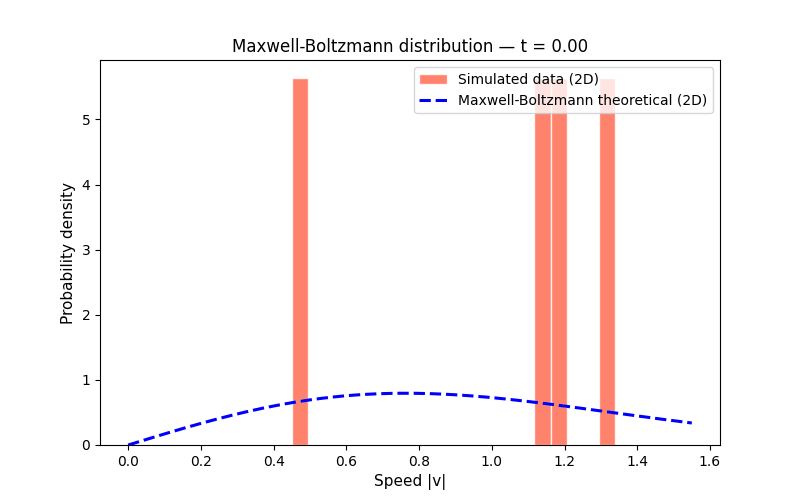
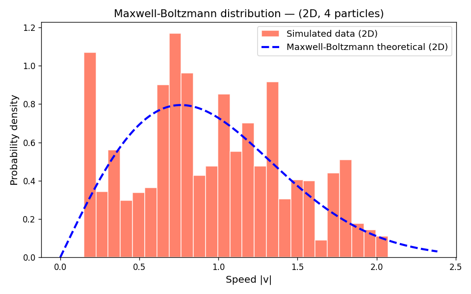
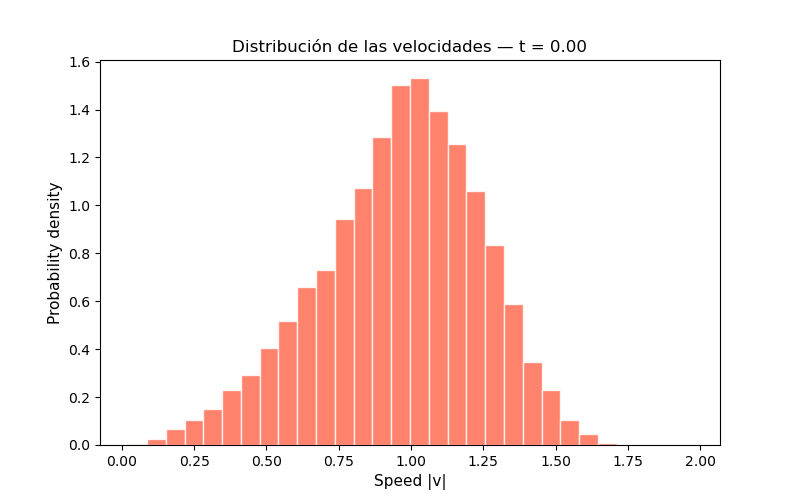
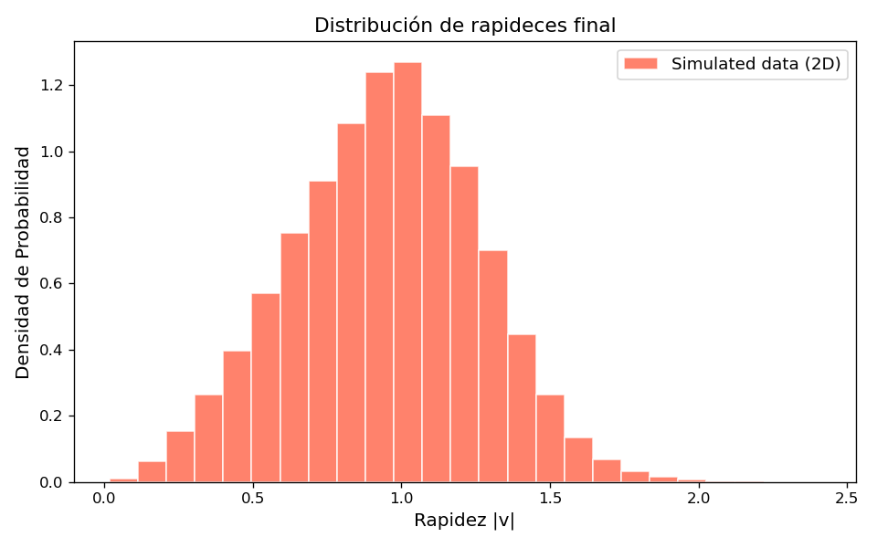

# Resultados del Programa

## Versión de Python

Al ejecutarse main.py

{ style="display: block; margin: 0 auto;" }

Además se crea un archivo **results_python.csv**, con los valores recopilados durante la simulación.

Utilizando los valores recopilados anteriormente, cuando se ejecuta boltzmann.py

{ style="display: block; margin: 0 auto;" }

Además de una imagen del resultado final

{ style="display: block; margin: 0 auto;" }

Este resultado no converge por completo a la curva teórica, esto se debe a la cantidad de particulas. Maxwell-Boltzmann es un resultado estadistico válido en $N \rightarrow \infty$. Si se desea un resultado más fidedigno al teórico, basta con ir aumentando el número de particulas dentro de la simulación.

## Versión de C++

Los valores obtenidos para la simulación en C++ también se utilizan en boltzmann.py:

{ style="display: block; margin: 0 auto;" }

{ style="display: block; margin: 0 auto;" }